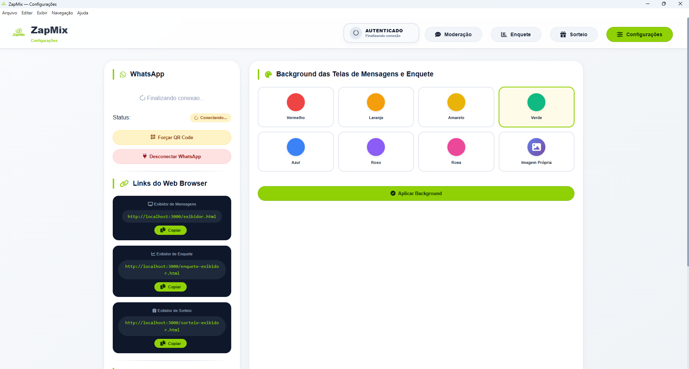

# 🚀 ZapMix – Gestão Inteligente para TV

[](LICENSE)
[](https://www.electronjs.org/)
[](https://nodejs.org/)
[](https://github.com/andersoncgpb1/zapmix/releases)

**ZapMix** é uma aplicação desktop (Windows) que integra **WhatsApp Web**, **enquetes ao vivo** e **NDI** para transmissão profissional. Permite receber mensagens do WhatsApp, moderar conteúdos (aprovar, rejeitar, colocar no ar), exibir enquete em tempo real e enviar tudo para o **vMix** via URLs dinâmicas e/ou **NDI**.



---

## ✨ Funcionalidades

### 📱 WhatsApp
- ✅ Conexão via QR Code com sessão persistente
- ✅ Suporte a **Microsoft Edge** (nativo do Windows) e **Google Chrome**
- ✅ Recebimento de mensagens, imagens, vídeos e áudios
- ✅ Reconexão automática em caso de desconexão

### 🧹 Moderação
- ✅ Mensagens pendentes → aprovar → colocar **NO AR (EM EXIBIÇÃO)**
- ✅ Editar nome, mensagem e mídias antes de aprovar
- ✅ Remover mensagens aprovadas individualmente
- ✅ Limpar todas as aprovadas de uma vez

### 📊 Enquete Interativa
- ✅ Votos por **palavras‑chave** no WhatsApp (ex: `coração`, `pele`, `cérebro`)
- ✅ Resultados em tempo real com barras de porcentagem
- ✅ Configuração flexível (pergunta, cores, palavras-chave)
- ✅ Pré-visualização ao vivo das alterações

### 🖼️ Mídias
- ✅ Imagens, vídeos e áudios recebidos via WhatsApp
- ✅ Player de vídeo personalizado (play, pause, tela cheia)
- ✅ Player de áudio com visualizador de ondas

### 🎬 vMix / NDI
- 🔗 **URLs dinâmicas** para colocar no vMix (Web Browser)
  - Exibidor de Mensagens: `http://localhost:3000/exibidor.html`
  - Exibidor de Enquete: `http://localhost:3000/enquete-exibidor.html`
- 📡 **NDI** (Network Device Interface) integrado
  - Fontes: `ZapMix - Exibidor de Mensagens` e `ZapMix - Enquete`
  - Compatível com vMix, OBS, e outros softwares compatíveis com NDI

### 🔧 Outras funcionalidades
- 🖌️ **Background personalizado** para as telas do vMix
- ✍️ **Simulação manual** de mensagens para testes
- 🗑️ **Limpeza total** (mensagens + arquivos locais)
- 🔄 **Auto-updater** com barra de progresso
- 🎨 **Modal personalizado** estilo Electron (confirmações modernas)

---

## 📦 Como executar (desenvolvimento)

1. **Clone o repositório**
   ```bash
   git clone https://github.com/andersoncgpb1/zapmix.git
   cd zapmix
